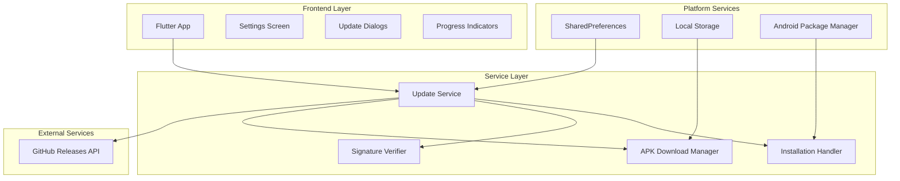
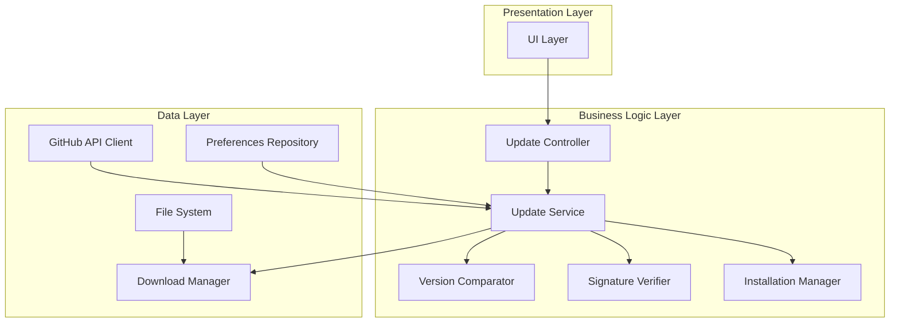
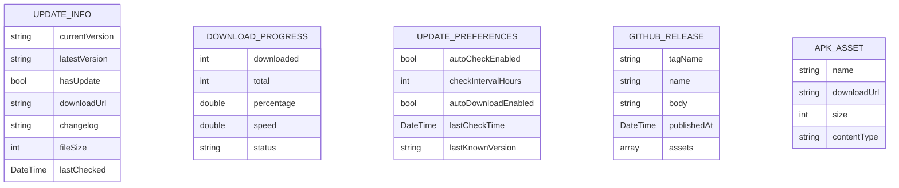

# Automatic Update Checker - Technical Architecture Document

## 1. Architecture Design



## 2. Technology Description

- Frontend: Flutter@3.7.2 + provider@6.1.1 + flutter_animate@4.3.0
- Additional Dependencies: http@1.1.0, crypto@3.0.3, package_info_plus@4.2.0, permission_handler@11.0.1, dio@5.3.2
- Platform: Android APK installation via platform channels
- Storage: SharedPreferences for update preferences, Local file system for APK downloads

## 3. Route Definitions

| Route | Purpose |
|-------|---------|
| /settings | Settings screen with integrated update checker section |
| N/A | Update dialogs are modal overlays, not separate routes |

## 4. API Definitions

### 4.1 Core API

#### GitHub Releases API
```
GET https://api.github.com/repos/{owner}/{repo}/releases/latest
```

Response:
| Param Name | Param Type | Description |
|------------|------------|-------------|
| tag_name | string | Version tag (e.g., "v1.0.1") |
| name | string | Release name |
| body | string | Release notes/changelog |
| assets | array | Download assets including APK |
| published_at | string | Release date |

Example Response:
```json
{
  "tag_name": "v1.0.1",
  "name": "JB Calculator v1.0.1",
  "body": "Bug fixes and performance improvements",
  "assets": [
    {
      "name": "app-release.apk",
      "browser_download_url": "https://github.com/owner/repo/releases/download/v1.0.1/app-release.apk",
      "size": 15728640
    }
  ],
  "published_at": "2024-01-15T10:30:00Z"
}
```

#### Update Service API

**Check for Updates**
```dart
Future<UpdateInfo?> checkForUpdates()
```

Response:
| Param Name | Param Type | Description |
|------------|------------|-------------|
| hasUpdate | bool | Whether update is available |
| latestVersion | string | Latest version string |
| currentVersion | string | Current app version |
| downloadUrl | string | APK download URL |
| changelog | string | Release notes |
| fileSize | int | APK file size in bytes |

**Download APK**
```dart
Stream<DownloadProgress> downloadApk(String url, String savePath)
```

Progress Stream:
| Param Name | Param Type | Description |
|------------|------------|-------------|
| downloaded | int | Bytes downloaded |
| total | int | Total file size |
| percentage | double | Download percentage (0-100) |
| speed | double | Download speed in bytes/sec |

**Verify APK Signature**
```dart
Future<bool> verifyApkSignature(String apkPath)
```

Response:
| Param Name | Param Type | Description |
|------------|------------|-------------|
| isValid | bool | Whether signature is valid |

## 5. Server Architecture Diagram



## 6. Data Model

### 6.1 Data Model Definition



### 6.2 Data Definition Language

#### Update Info Model
```dart
class UpdateInfo {
  final String currentVersion;
  final String latestVersion;
  final bool hasUpdate;
  final String downloadUrl;
  final String changelog;
  final int fileSize;
  final DateTime lastChecked;
  
  UpdateInfo({
    required this.currentVersion,
    required this.latestVersion,
    required this.hasUpdate,
    required this.downloadUrl,
    required this.changelog,
    required this.fileSize,
    required this.lastChecked,
  });
  
  factory UpdateInfo.fromJson(Map<String, dynamic> json) {
    return UpdateInfo(
      currentVersion: json['current_version'],
      latestVersion: json['latest_version'],
      hasUpdate: json['has_update'],
      downloadUrl: json['download_url'],
      changelog: json['changelog'],
      fileSize: json['file_size'],
      lastChecked: DateTime.parse(json['last_checked']),
    );
  }
}
```

#### Download Progress Model
```dart
class DownloadProgress {
  final int downloaded;
  final int total;
  final double percentage;
  final double speed;
  final DownloadStatus status;
  
  DownloadProgress({
    required this.downloaded,
    required this.total,
    required this.percentage,
    required this.speed,
    required this.status,
  });
}

enum DownloadStatus {
  idle,
  downloading,
  completed,
  failed,
  cancelled
}
```

#### Update Preferences Model
```dart
class UpdatePreferences {
  final bool autoCheckEnabled;
  final int checkIntervalHours;
  final bool autoDownloadEnabled;
  final DateTime? lastCheckTime;
  final String? lastKnownVersion;
  
  UpdatePreferences({
    this.autoCheckEnabled = true,
    this.checkIntervalHours = 24,
    this.autoDownloadEnabled = false,
    this.lastCheckTime,
    this.lastKnownVersion,
  });
  
  // SharedPreferences serialization methods
  Map<String, dynamic> toJson() {
    return {
      'auto_check_enabled': autoCheckEnabled,
      'check_interval_hours': checkIntervalHours,
      'auto_download_enabled': autoDownloadEnabled,
      'last_check_time': lastCheckTime?.toIso8601String(),
      'last_known_version': lastKnownVersion,
    };
  }
}
```

#### GitHub Release Model
```dart
class GitHubRelease {
  final String tagName;
  final String name;
  final String body;
  final DateTime publishedAt;
  final List<GitHubAsset> assets;
  
  GitHubRelease({
    required this.tagName,
    required this.name,
    required this.body,
    required this.publishedAt,
    required this.assets,
  });
  
  factory GitHubRelease.fromJson(Map<String, dynamic> json) {
    return GitHubRelease(
      tagName: json['tag_name'],
      name: json['name'],
      body: json['body'] ?? '',
      publishedAt: DateTime.parse(json['published_at']),
      assets: (json['assets'] as List)
          .map((asset) => GitHubAsset.fromJson(asset))
          .toList(),
    );
  }
}

class GitHubAsset {
  final String name;
  final String downloadUrl;
  final int size;
  final String contentType;
  
  GitHubAsset({
    required this.name,
    required this.downloadUrl,
    required this.size,
    required this.contentType,
  });
  
  factory GitHubAsset.fromJson(Map<String, dynamic> json) {
    return GitHubAsset(
      name: json['name'],
      downloadUrl: json['browser_download_url'],
      size: json['size'],
      contentType: json['content_type'] ?? 'application/vnd.android.package-archive',
    );
  }
}
```