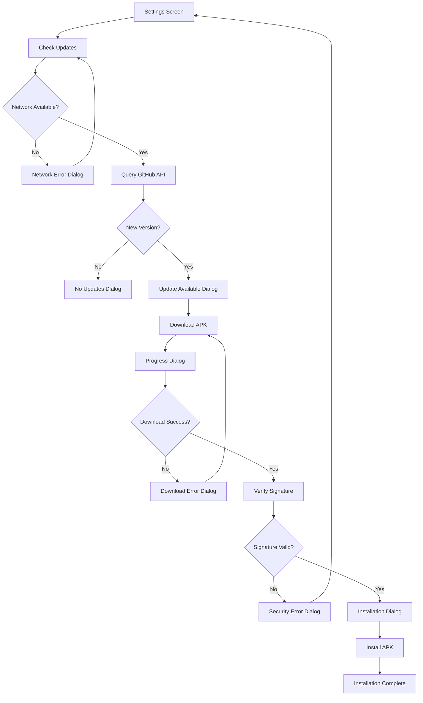

# Automatic Update Checker - Product Requirements Document

## 1. Product Overview
An automatic update checker system for the JB Calculator Flutter app that monitors GitHub releases, downloads newer APK versions, and facilitates secure installation with comprehensive user notifications.

The system addresses the need for seamless app updates without requiring users to manually check app stores, ensuring users always have access to the latest features and security patches while maintaining installation security through APK signature verification.

## 2. Core Features

### 2.1 User Roles
No role distinction required - all users have access to the update functionality.

### 2.2 Feature Module
Our automatic update checker consists of the following main components:
1. **Settings Integration**: Update checker section within existing settings screen with manual check option and auto-update preferences.
2. **Update Detection**: Background service that checks GitHub releases API and compares versions with current app version.
3. **Download Manager**: Secure APK download with progress tracking and signature verification.
4. **Installation Handler**: APK installation initiation with proper Android permissions and user guidance.
5. **Notification System**: User alerts for update availability, download progress, and installation status.

### 2.3 Page Details

| Page Name | Module Name | Feature description |
|-----------|-------------|---------------------|
| Settings Screen | Update Checker Section | Display current version, check for updates button, auto-update toggle, last check timestamp |
| Settings Screen | Update Status Dialog | Show update availability with version details, changelog preview, download/install options |
| Settings Screen | Download Progress Dialog | Real-time download progress bar, cancel option, estimated time remaining |
| Settings Screen | Installation Dialog | Installation status, security verification results, completion confirmation |
| Settings Screen | Error Handling Dialogs | Network error messages, download failure alerts, installation problem notifications with retry options |

## 3. Core Process

### Main User Flow
1. User opens Settings screen and sees current app version (1.0.0)
2. User taps "Check for Updates" or system performs automatic check
3. System queries GitHub releases API for latest version
4. If newer version available, user sees update dialog with version details
5. User confirms download, system downloads APK with progress indicator
6. System verifies APK signature for security
7. User is prompted to install, system initiates Android installation process
8. User receives confirmation of successful update

### Error Handling Flow
1. Network connectivity issues → Show retry dialog with offline indicator
2. Download failures → Display error message with retry option and alternative download methods
3. Signature verification failure → Block installation and show security warning
4. Installation problems → Guide user through manual installation steps

## 4. User Interface Design

### 4.1 Design Style
- Primary colors: Consistent with existing app theme (dark/light mode support)
- Secondary colors: Blue (#2196F3) for update actions, Red (#F44336) for errors, Green (#4CAF50) for success
- Button style: Rounded corners (12px radius) matching existing design
- Font: Poppins family, sizes 12-16px for consistency
- Layout style: Card-based design with proper spacing and elevation
- Icons: Material Design icons for download, security, and status indicators

### 4.2 Page Design Overview

| Page Name | Module Name | UI Elements |
|-----------|-------------|-------------|
| Settings Screen | Update Section | Card container with current version text, "Check for Updates" button, auto-update toggle switch, last check timestamp in secondary text color |
| Update Dialog | Version Info | Modal dialog with app icon, version comparison table, changelog preview, "Download" and "Cancel" buttons |
| Progress Dialog | Download Status | Circular progress indicator, percentage text, download speed, "Cancel" button, estimated time remaining |
| Installation Dialog | Security Status | Shield icon, signature verification status, "Install" button, security warning text if needed |
| Error Dialogs | Error Messages | Warning/error icons, descriptive error text, "Retry" and "Cancel" buttons, troubleshooting tips |

### 4.3 Responsiveness
Desktop-first design with mobile-adaptive layout, optimized for touch interactions on mobile devices with appropriate button sizes and spacing for easy tapping.